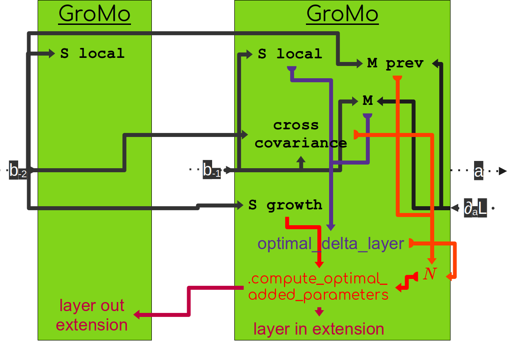

GrowingModule (GroMo)
=====================

This is the documentation of the growing method described in [TMLR24]_.

We propose to build growing networks using `GroMo` inherited from `torch.nn.Module`. We have two types of modules, the standard `GrowingModule` and the `AdditionGrowingModule`. The first one is a connection that contains the parameters of the network. The second one aims to connect multiple `GrowingModule` together.

=====================
Attributes
=====================

To compute the special updates (*i.e.* the ones that are different from classical gradient descent) we need to store tensor statistics. Those are computed using the `TensorStatistics` class as they are averaged over possibly multiple machine batches.

Here is a list of statistics that can be useful:

- `S local`: the tensor :math:`S_{-1}` for the natural gradient
- `M`: the tensor :math:`M_{-1}` for the natural gradient
- `S growth`: the tensor :math:`S_{-2}` to compute the new weights
- `M prev`: the tensor :math:`M_{-2}` to compute the new weights
- `cross covariance`: the cross covariance :math:`P` to compute the new weights

Intermediate quantities
------------------------

To compute those statistics we need to access some intermediate quantities:

- :math:`a`: the pre-activation of the layer
- :math:`\nabla_{a} \mathcal{L}`: the gradient of the loss with respect to the pre-activation
- :math:`b_{-1}`: the activation of the previous layer
- :math:`b_{-2}`: the activation of two layers before

We store those quantities in the `GroMo` module directly. Depending on the situation it can be stored in different places but it is transparent for the user as we surcharge `input` and `pre_activity` to access those quantities in the same way.

.. image:: images/gromo_links.png
    :width: 800px
    :align: center
    :height: 565px
    :alt: Where are quantities stored ?

When we link only `GrowingModule` modules together, the quantities are stored in the `GrowingModule` module. When we link `GrowingModule` with `AdditionGrowingModule` the quantities are stored in the `AdditionGrowingModule`.  This is due to the fact that we use the `AdditionGrowingModule` when we connect multiple `GrowingModule` together and we do not want to store the same quantities multiple times. Hence we store them in the `AdditionGrowingModule` and we can access them from the `GrowingModule`. Note that we perform the activation after the addition in the `AdditionGrowingModule` so that we can access the pre-activity of the previous layer as the input of the next layer.

Statistical quantities
------------------------

The computation of all statistic has the same structure.

1. Firstly the statistic is created as an instance of `TensorStatistics`.
2. Then we use our network to compute intermediate quantities. During this forward pass we store the intermediate quantities as explained above and we set the statistics as not updated. This is to ensure that we do not update a statistic multiple times with the same data.
3. We call the method `update` of the statistic to update it with the intermediate quantities. This includes updating the number of samples seen to compute the current statistic.
4. We can then access the statistic by calling it (i.e. using `__call__`).

The previously mentioned statistics (`S local`, `M`, `S growth`, `M prev`, `cross covariance`) are transparently accessible in the `GrowingModule`. However they are not necessarily stored in the `GrowingModule`. In the case of a `GrowingModule`,  (`M`, `M prev`, `cross covariance`) are computed in the `GrowingModule`. `S local` is computed either in the previous module if it is an `AdditionGrowingModule` or in the `GrowingModule` if it is a `GrowingModule` (this is due to the fact that all next modules of an addition module require the same `S local`). The computation of `S growth` done directly in the module with the input of the previous module (However due to the fact that in the case of fully-connected layers (`nn.Linear`) the `S growth` is exactly the `S local` of the previous module, we do not recompute it, and simply point to the S local tensor of the previous module). (Note that here we talk about the `S growth` used by the current layer to compute new weights. Indeed, the layer still needs to compute a `S growth` but which is used by the next layer to compute its new weights).

`S local` and `S growth` (for the next module) tensors are computed using the input of the module. `cross covariance` is computed using the input of the module and of the previous module. `M` is computed using the input and the output gradient of the module. `M prev` is computed using the input of the previous module and the output gradient of the current module.

Updates
--------

Once the statistics are computed we can compute the optimal updates. First the natural gradient using the `S local` and `M` tensors that get stored in the `optimal_delta_layer` attribute of the module. Then we can compute the tensor `N` using the `cross covariance` and `M prev` tensors. Finally we can compute the new weights using the `S growth` and `N` tensors. Those new weights are stored in the `layer_in_extension` attribute of the current module and in the `layer_out_extension` attribute of the previous module.

Wrap-up
---------------------

If we take an example with two growing modules and look at most of the objects that are computed we have the following graph:

The first step is to compute the statistics (the objects written in black) and which are directly computed from intermediate quantities of the network (the gray arrows indicate the dependencies of each statistic). Then we can compute the optimal parameter update (represented by `optimal_delta_layer` and represented in purple). Finally we can compute the new weights using the method `compute_optimal_added_parameters` (represented in red) which store the result in the `layer_in_extension` attribute of the current module and in the `layer_out_extension` attribute of the previous module.

=====================
Growing a layer
=====================

Sequential case
----------------

To grow a layer of neurons, we need new incoming connections and new outgoing connections. If we look at the section with two modules `M1` and `M2` with a layer of neurons in between, we can grow the layer of neurons by adding new outgoing connections in `M1` (noted `O1`) and new incoming connections in `M2` (noted `I2`). To compute the new weights with the TINY/FoGro method we can use the method `compute_optimal_added_parameters` in `M2` that will also update the module `M1` if the option `update_previous` is set to `True`.

You can then use the `extended_forward` method to compute the forward pass with the new weights. More precisely, the `extended_forward` with integrating the `scaling_factor` (noted :math:`\gamma`) to the forward pass:

- :math:`\texttt{extended_forward}(x) = (M1(x), \gamma  O1(x))`
- :math:`\texttt{extended_forward}(M1(x), \gamma  O1(x)) = M2(M1(x)) + \gamma^2  I2(O1(x))`

Once satisfied with the extension and the scaling factor, they are incorporated in the forward pass by using the method `apply_change` in `M2` with the option `apply_previous` set to `True`.

=====================
Glossary
=====================

- Machine batch / Statistical batch: often in ML we use batch of data to estimate quantities and to process data together to make computation faster. For example, in stochastic gradient descent we estimate the gradient on a batch of examples that is computed at the same time. In our case we can compute multiple examples at the same time and do it multiple times to compute a statistic. We refer to the first one to machine batch and to the second as statistical batch.

=============
Bibliography
=============

.. [TMLR24] Verbockhaven, M., Rudkiewicz, T., Chevallier, S., and Charpiat, G.
        (2024). Growing tiny networks: Spotting expressivity bottlenecks and
        fixing them optimally. TMLR.
